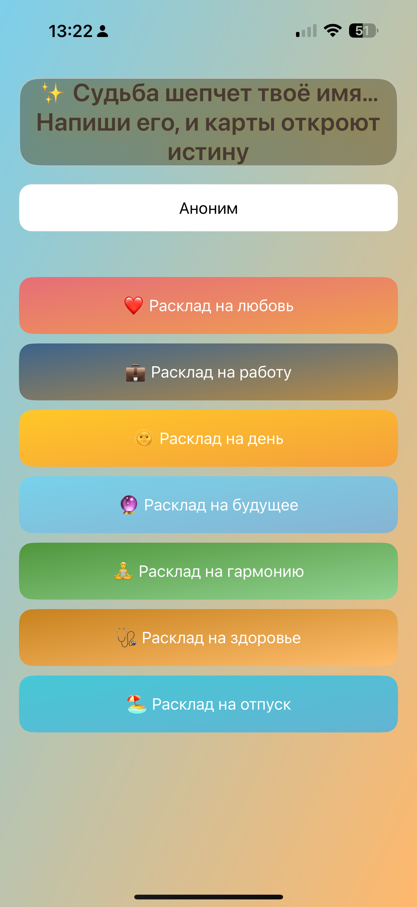
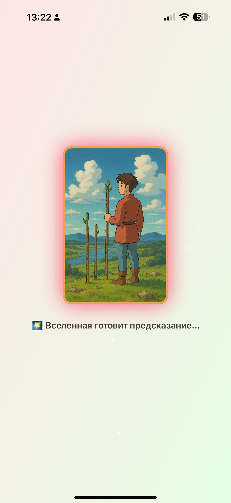
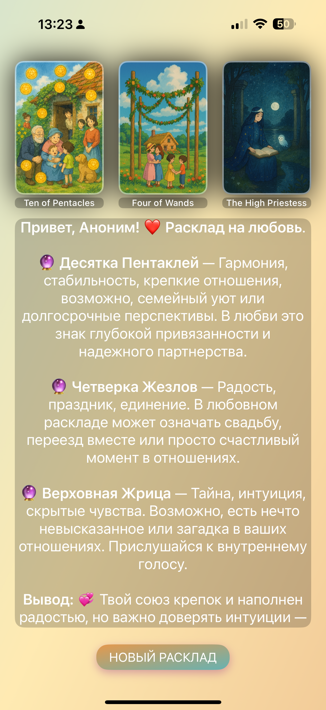

# 🔮 TaroApp

Интерактивное iOS-приложение для раскладов Таро с использованием нейросетевого анализа DeepSeek API.

---

## 📸 Скриншоты

| Главный экран | Экран загрузки | Результат |
|:-------------:|:--------------:|:---------:|
|  |  |  |

---

## ✨ Возможности

- 🎴 8 тематических раскладов (любовь, карьера, день, будущее, гармония, здоровье, карма, отпуск)
- 🧠 AI-интерпретация через DeepSeek API
- 📚 История гаданий с избранным
- 📊 Статистика использования карт
- 🌐 Русский и английский языки
- 🌓 Темная тема
- 🎨 Динамические градиенты
- 📤 Генерация изображений для шаринга
- 🎭 Haptic feedback
- 💾 Работа оффлайн

---

## 🏗️ Архитектура

**MVVM-C** (Model-View-ViewModel-Coordinator) — чистая архитектура для тестируемости и масштабируемости.

### Структура проекта

```
TaroApp/
├── App/                    # AppDelegate, SceneDelegate
├── Models/                 # TarotCard, Prediction, UserSettings, SpreadType
├── Coordinators/           # MainCoordinator (навигация)
├── Services/               # Сервисный слой
│   ├── NetworkService      # Сеть (async/await, URLSession)
│   ├── StorageService      # Хранилище (UserDefaults, JSON)
│   ├── ThemeManager        # Темы (light/dark)
│   ├── LanguageManager     # Локализация
│   ├── CardLocalizer       # Перевод карт
│   └── ShareImageGenerator # Генерация картинок
├── ViewModels/             # MainVM, PredictionVM, HistoryVM
└── Views/
    ├── Screens/            # 8 экранов (Main, Prediction, History, Settings и др.)
    └── Components/         # UI-компоненты, Design System
```

### Принципы

**Model** → Данные (TarotCard, Prediction, UserSettings)
**View** → UIKit контроллеры (programmatic UI, без Storyboard)
**ViewModel** → Бизнес-логика + состояние (LoadingState<T>)
**Coordinator** → Навигация + Dependency Injection
**Services** → Protocol-based сервисы (network, storage, theme)

---

## 🛠️ Технологии

- **Swift 5.9+**, **UIKit** (programmatic UI)
- **URLSession**, **async/await**, **Codable**
- **UserDefaults** для локального хранения
- **DeepSeek API** для AI-интерпретаций
- **Backend**: Node.js на Render

---

## 🚀 Установка

```bash
git clone https://github.com/TaZMaN-tech/TaroApp.git
cd TaroApp
open TaroApp.xcodeproj
```

Требования: **iOS 15.0+**, **Xcode 15+**

---

## 🔌 API Backend

**Endpoint**: `POST https://taroapp-back.onrender.com/tarot?ver=0.1`

```json
// Request
{
  "cards": ["The Fool", "The Magician", "The High Priestess"],
  "name": "Имя пользователя",
  "lang": "ru",
  "subject": "Любовь"
}

// Response
{
  "content": "Текст предсказания от AI..."
}
```

---

## 🎨 UI/UX

- **Design System**: цвета + темная тема, SF Pro шрифты, консистентные стили
- **Анимации**: плавные переходы, раскрытие карт, loading states
- **Локализация**: RU/EN, динамическая смена без перезапуска
- **Haptic Feedback**: тактильная обратная связь

---

## 🛣️ Roadmap

- [ ] Unit/UI тесты
- [ ] Яндекс Реклама SDK
- [ ] Push-уведомления
- [ ] iOS Widget
- [ ] iPad поддержка
- [ ] Анимированные карты
- [ ] Premium подписка

---

## 👨‍💻 Автор

**Тадевос Курдоглян**
GitHub: [@TaZMaN-tech](https://github.com/TaZMaN-tech) • Email: kurdoglian@gmail.com

---

**⭐ Если проект понравился — поставь звезду!**
